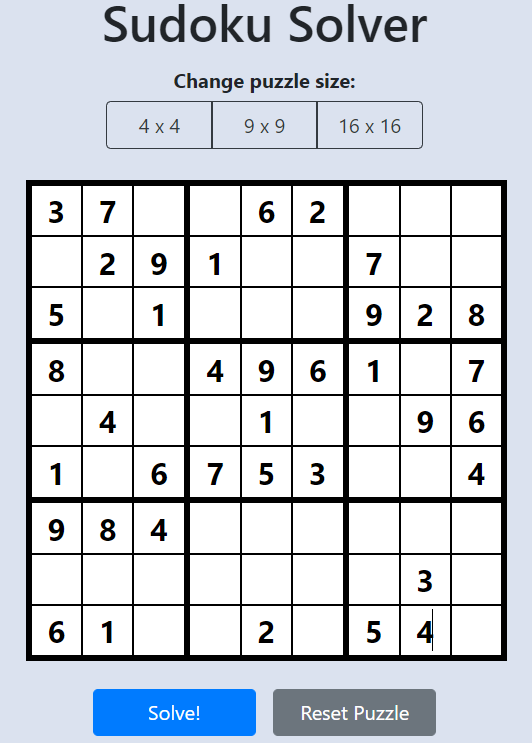
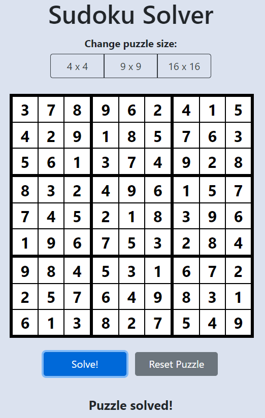

# SudokuSolverWeb-Frontend
This is the front end of a sudoku solver web app written in Javascript using React. The page was styled using React Boostrap. This web app is available online at [http://sudoku-kg.herokuapp.com](http://sudoku-kg.herokuapp.com). 

Additionally, the API can be queried directly by sending a post request to [http://sudoku-api-kg.herokuapp.com](http://sudoku-api-kg.herokuapp.com). See the repository for [SudokuSolverWeb-Backend](https://github.com/kellygemmill/SudokuSolverWeb-Backend) for details on the API and backend Java code. 

## Sample Screenshots: 

### Unsolved 9x9 Board: 

### Solved 9x9 Board:

## React Components:

### BoardArea:
The BoardArea component contains everything related to rendering and manipulating the sudoku board. State variables and callbacks are also defined in this section (see below).

#### BoardSizeSelector:
The BoardsizeSelectorcomponent returns a button group with three size options for the sudoku puzzle: 4x4, 9x9, and 16x16. Larger puzzles (such as 25x25) can be added by adding an additional button which returns the larger side length in the "value" field on click; however, the larger puzzles take exponentially longer to solve and are therefore impractical to support on the site.

#### LargeBoardDirections:
This component is displayed when a board larger than 9x9 is selected and instructs the user to represent numbers higher than 9 as letters. This is typical in "giant sudoku" online sites in order to keep each cell to 1 character.

#### SudokuBoard:
This component represents the sudoku board. The sudoku board is built up of smaller Square components which are arranged in a grid. The Squares are generated by mapping each value of the sudokuBoard state variable to a Square component. The grid is displayed using "gridTemplate" in the component style. The dimensions of the grid are defined through the props that are passed to the SudokuBoard component.

#### Square:
The Squares are the individual units of the SudokuBoard component. The square is an input field with a border. The each of the four borders are set such that when all squares are combined they create the expected sudoku board grid (thin lines separating squares in the same sub-box, thick lines separating sub-boxes). 

#### BottomButtons:
Below the board are two buttons: one to solve the puzzle and one to reset the board.

#### Solution: 
Below the buttons a message is printed stating whether the puzzle was solved or not. Before the "Solve" button is clicked, no message is displayed.

#### Directions:
This section gives directions to the user.

### Footer:
The footer contains links to the Github repositories for both the backend and frontend, as well as a copyright statement with a link to Kelly Gemmill's LinkedIn profile.

## State Variables and Callbacks:
All state variables and callback functions are defined in the BoardArea component. 

### State Variables:
The state variables include the board length, board size, sudoku board (defined as a 1-d character array of the same size as the board) and the message to display below the board (either "Puzzle solved" or "No solution found").

### Callbacks and Auxiliary Functions:

#### solvePuzzle(): 
This is the callback function for the "Solve!" button. The values in the puzzle are converted to integers and then sent to the solver API. Upon response, the sudokuBoard and solutionFound state variables are updated in accordance with the response from the API.

#### convertToInt(value):
This function converts a character from the sudoku board to an integer in order to send to the API, as the API requires an integer array. This also requires converting alphabetical characters to the required equivalent integer (A -> 10, B -> 11, etc.) and converting empty spaces to 0, as required by the API.

#### convertToChar(value):
This function converts the integers sent from the API back to a characters, including converting 0 to an empty space (if the board was not solved) and converting numbers greater than 9 to letters.

#### handleSudokuInput(event):
This function updates the sudoku board state variable to what is input by the user. The function ensures that each box only contains one value, which is bounde by the size of the board (e.g. if the user tries to input a 5 in a 4x4 board, nothing is displayed). Additionally, for large boards, lowercase character entries are converted to uppercase.

